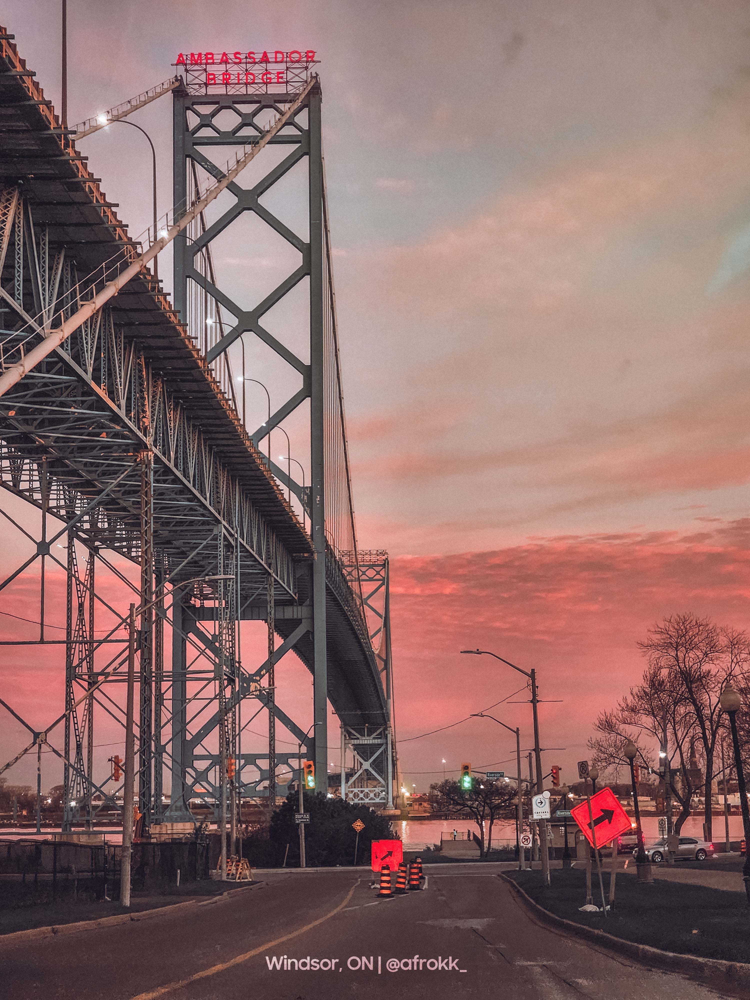

# 💫 About Me:

👨‍🎓 Currently a Full-time Computer Science Student at the University of Windsor.  🔭 I’m currently working on a mobile app called <a href="https://github.com/UsmanAJabbar/quest">Quest</a> and an API. 💬 Open to Software Engineering roles where I can learn and jump on opposite sides of the stack.  💡 On the side, I'm an avid gamer, content creator, and photographer. ⚡ Fun Fact: I've built over 10 gaming PCs.   🌐 <a href="https://afrokk.dev/">afrokk.dev</a>, <a href="https://afrokk.design/">afrokk.design</a>, <a href="mailto:hi@afrokk.dev">email: hi@afrokk.dev</a>

## 🌐 Socials:
    
   

# 💻 Tech Stack:
              

# 📊 GitHub Stats:
<!--   -->
 
<!--  -->
